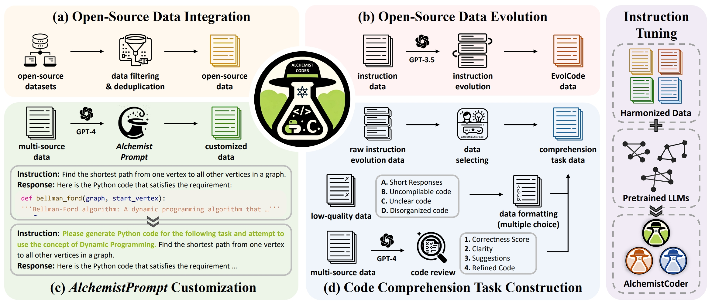
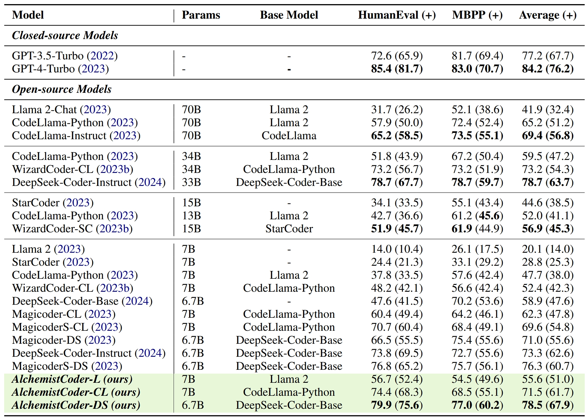
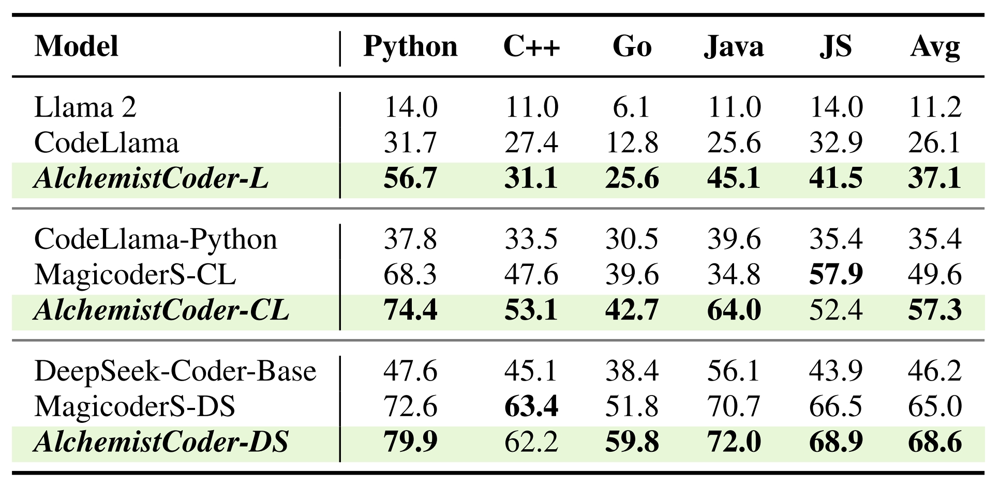
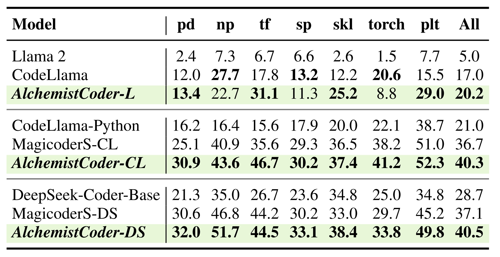

# AlchemistCoder: Harmonizing and Eliciting Code Capability by Hindsight Relabeling on Multi-source Data

> Zifan Song<sup>1,2*</sup>,
Yudong Wang<sup>2*</sup>,
Wenwei Zhang<sup>2*</sup>,
Kuikun Liu<sup>2</sup>,
Chengqi Lyu<sup>2</sup>,
Demin Song<sup>2</sup>,
Qipeng Guo<sup>2</sup>,
Hang Yan<sup>2</sup>,
Dahua Lin<sup>2,3</sup>,
Kai Chen<sup>2†</sup>,
Cairong Zhao<sup>1†</sup>
>
> <sup>*</sup> Equal Contribution, <sup>†</sup> Corresponding Author 
>
> <sup>1</sup> Tongji University, <sup>2</sup> Shanghai AI Laboratory, <sup>3</sup> Chinese University of Hong Kong

[](https://arxiv.org/abs/xxxx.xxxx)
[](./LICENSE)

<p align="left">
    <i class="fas fa-cube"></i>📦&nbsp;<a href="#-models">Models</a>
    | 🚀&nbsp;<a href="#-quick-start"> Quick Start</a>
    | 😃&nbsp;<a href="#-acknowledgments">Acknowledgements</a>
    | 📧&nbsp;<a href="#-contact">Contact</a>
    | 🌟&nbsp;<a href="#-citation">Citation</a>
</p>

## 📢 News
* **(March xx, 2024)**
  - Paper and models for *AlchemistCoder* are released 🔓


## ✨ Highlights


> **<p align="justify"> Abstract:** *Open-source Large Language Models (LLMs) and their specialized variants, particularly Code LLMs, have recently delivered impressive performance. However, previous Code LLMs are typically fine-tuned on a single dataset, which may insufficiently elicit the potential of pre-trained Code LLMs. This paper presents AlchemistCoder, a series of Code LLMs with better code generation and generalization abilities fine-tuned on multi-source data. To harmonize the inherent conflicts among the various styles and qualities in multi-source data, we introduce data-specific prompts, termed AlchemistPrompts, inspired by hindsight relabeling, to improve the consistency between instructions and responses. We further propose to incorporate the data evolution process itself into the fine-tuning data to enhance the code comprehension capabilities of LLMs, including instruction evolution, data filtering, and code review. Extensive experiments demonstrate that AlchemistCoder holds a clear lead among all models of the same size (6.7B/7B) and rivals or even surpasses larger models (15B/33B/70B), showcasing the efficacy of our method in refining instruction-following capabilities and advancing the boundaries of code intelligence.* </p>

- **AlchemistPrompts**: Designed as data-specific prompts for harmonizing inherent conflicts in multi-source data and mitigating the instruction/response misalignment at a fined-grained level.
  
- **Code Comprehenstion Tasks**: Sourced from the process of data construction, consisting of instruction evolution, data filtering, and code review.
  
- **Harmonized Multi-source Data**: Instruction tuned on 200M tokens, including 6 types of high-quality data.
  
- **Superior Model Performance**: Surpassing all the open-source models of the same size (6.7/7B), and rivaling or even beating larger models (15B/33B/70B/ChatGPT) on 6 code benchmarks.
  
- **Advanced generic capabilities**: Demonstrated by the significant improvements on MMLU, BBH, and GSM8K.
  

## 📈 Evaluation Results
We adopt 9 benchmarks to evaluate our *AlchemistCoder* series models, including 6 code benchmarks (**HumanEval**, **HumanEval+**, **MBPP**, **MBPP+**, **HumanEval-X**, and **DS-1000**) and 3 mainstream benchmarks (**MMLU** for multitask language understanding, **BBH** for comprehensive reasoning, and **GSM8K** for mathematical ability). All evaluations are conducted through [**OpenCompass**](https://github.com/open-compass), an LLM evaluation platform, supporting a wide range of models (LLaMA, LLaMa2, ChatGLM2, ChatGPT, Claude, etc) over 80+ datasets. 

We focus on comparing the ```pass@1``` metric and detailed evaluation results are reported below:
- *AlchemistCoder* holds a clear lead among all models of the same size and rivals or even surpasses larger models.


- Python Code Generation Benchmark(HumanEval/HumanEval+ and MBPP/MBPP+):


- Multilingual HumanEval-X Benchmark:


- Data Science DS-1000 Benchmark:


- Mainstream Benchmarks (MMLU, BBH, and GSM8K) for Generic Capabilities:


## 📦 Models
All *AlchemistCoder* series models have been open-source on Hugging Face, including AlchemistCoder-L-7B, AlchemistCoder-CL-7B, and AlchemistCoder-DS-6.7B. You can access our models via the following link:

## 🚀 Quick Start
```python
import torch
from transformers import AutoModelForCausalLM, AutoTokenizer

tokenizer = AutoTokenizer.from_pretrained("internlm/AlchemistCoder-DS-6.7B", trust_remote_code=True)
model = AutoModelForCausalLM.from_pretrained("internlm/AlchemistCoder-DS-6.7B", trust_remote_code=True, torch_dtype=torch.bfloat16).cuda()
model = model.eval()

input_text = "Implement the Dijkstra algorithm in Python"
inputs = tokenizer(input_text, return_tensors="pt").to(model.device)
outputs = model.generate(**inputs, max_length=128)
print(tokenizer.decode(outputs[0], skip_special_tokens=True))
```

The above code will generate the following result:
> ```python
> import heapq
> 
> def dijkstra(graph, start, end):
>     """
>     Find the shortest path between two nodes in a graph using Dijkstra's algorithm.
> 
>     Args:
>         graph (dict): A dictionary representing the graph, where the keys are nodes and the values are dictionaries
>                       containing the neighboring nodes and their edge weights.
>         start: The starting node.
>         end: The target node.
> 
>     Returns:
>         list: The shortest path from the start node to the target node as a list of nodes.
> 
>     Raises:
>         ValueError: If either the start or end node is not present in the graph.
> 
>     """
> 
>     # Check if start and end nodes are in the graph
>     if start not in graph:
>         raise ValueError("Start node is not present in the graph.")
>     if end not in graph:
>         raise ValueError("End node is not present in the graph.")
> 
>     # Initialize the distance dictionary with infinite distances for all nodes
>     distances = {node: float('inf') for node in graph}
> 
>     # Set the distance of the start node to 0
>     distances[start] = 0
> 
>     # Initialize the heap with the start node
>     heap = [(0, start)]
> 
>     # Initialize the previous dictionary to keep track of the path
>     previous = {}
> 
>     while heap:
>         # Pop the node with the smallest distance from the heap
>         current_distance, current_node = heapq.heappop(heap)
> 
>         # If the current node is the end node, we have found the shortest path
>         if current_node == end:
>             # Reconstruct the path by following the previous nodes
>             path = []
>             while current_node in previous:
>                 path.append(current_node)
>                 current_node = previous[current_node]
>             path.append(start)
>             # Reverse the path to get the correct order
>             return path[::-1]
> 
>         # Iterate over the neighboring nodes and update their distances
>         for neighbor, weight in graph[current_node].items():
>             new_distance = current_distance + weight
>             # If a shorter path is found, update the distance and previous node
>             if new_distance < distances[neighbor]:
>                 distances[neighbor] = new_distance
>                 previous[neighbor] = current_node
>                 heapq.heappush(heap, (new_distance, neighbor))
> 
>     # If there is no path between the start and end nodes, return an empty list
>     return []
> ```
> 
> The `dijkstra` function takes three arguments: `graph`, `start`, and `end`. The `graph` argument is a dictionary representing the graph, where the keys are nodes and the values are dictionaries containing the neighboring nodes and their edge weights. The `start` argument is the starting node, and the `end` argument is the target node.
> 
> The function first checks if the start and end nodes are present in the graph. If either node is not present, a `ValueError` is raised.
> 
> The function then initializes a `distances` dictionary with infinite distances for all nodes. It sets the distance of the start node to 0. It also initializes a heap with the start node and a `previous` dictionary to keep track of the path.
> 
> The algorithm then iterates over the nodes in the heap. For each node, it checks if it is the end node. If it is, the function reconstructs the path by following the previous nodes and returns the shortest path as a list of nodes in the correct order.
> 
> If the current node is not the end node, the algorithm iterates over its neighboring nodes and updates their distances if a shorter path is found. It also updates the `previous` dictionary to keep track of the path.
> 
> If there is no path between the start and end nodes, the function returns an empty list.
> 
> Note that this implementation assumes that the graph is a directed graph, and it uses a heap data structure to efficiently select the node with the smallest distance at each step.

## 🧪 Evaluation
To effortlessly evaluate *AlchemistCoder* series models across a wide range of benchmarks, such as HumanEval and MBPP, you can use [**OpenCompass**](https://github.com/open-compass) with just one command. To get started, [install OpenCompass](https://opencompass.readthedocs.io/en/latest/get_started/installation.html), adopt the provided configuration file in ```eval/opencompass/configs``` and simply run the commands below:
```bash
cd opencompass
python run.py configs/eval_alchemistcoder_models_hf_official/eval_alchemistcoder_models_hf_code.py
python run.py configs/eval_alchemistcoder_models_hf_official/eval_alchemistcoder_models_hf_coreset.py
```
Make sure to adjust the directory structure and arguments according to your requirements.

## 📖 Fine-tune and Others
Please refer to [**InternLM**](https://github.com/InternLM/InternLM/tree/main).

## 😃 Acknowledgments
*AlchemistCoder* is built with [**InternLM**](https://github.com/InternLM) and [**OpenCompass**](https://github.com/open-compass). Thanks for their awesome work!

## 📧 Contact
If you have any questions, please create an issue on this repository or contact us at:
- sugger@tongji.edu.cn
- wangyudong@pjlab.org.cn
- zhangwenwei@pjlab.org.cn

## 🌟 Citation
If you find our work useful, please consider citing:

```bibtex

```
